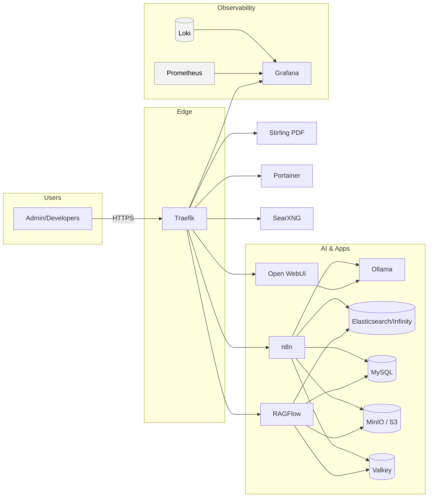

# Architecture

**Notes**
- Traefik terminates TLS (ACME DNS-01). UIs behind basic auth where needed.
- Open WebUI, RAGFlow, and n8n share Ollama as the default LLM backend.
- RAGFlow and n8n use Infinity/Elasticsearch, MySQL, MinIO, and Valkey for pipelines and automations.
- Prometheus/Grafana/Loki provide metrics/logs.
