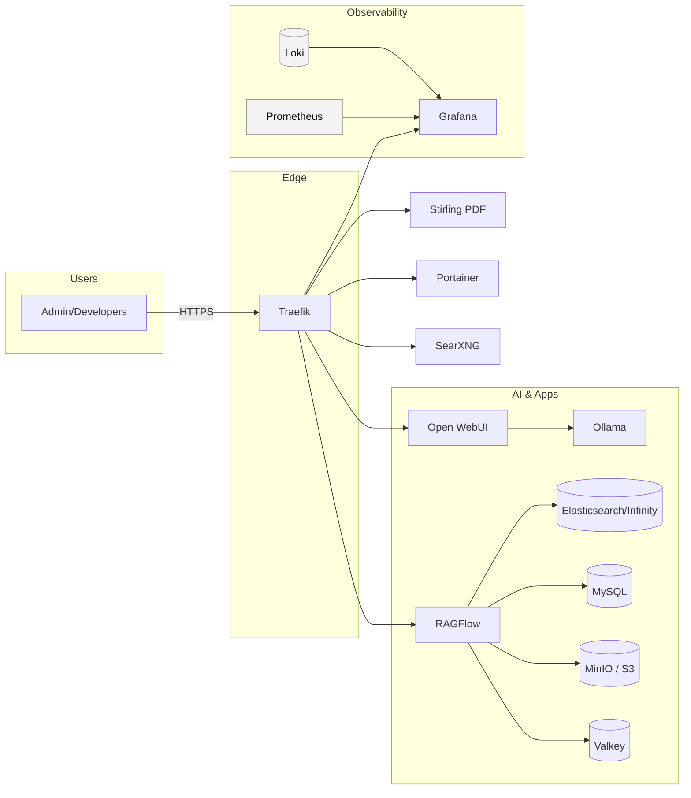

# Architecture

**Notes**
- Traefik terminates TLS (ACME DNS-01). UIs behind basic auth where needed.
- Open WebUI talks to Ollama. RAGFlow uses Infinity/Elasticsearch, MySQL, MinIO, Valkey.
- Prometheus/Grafana/Loki provide metrics/logs.
